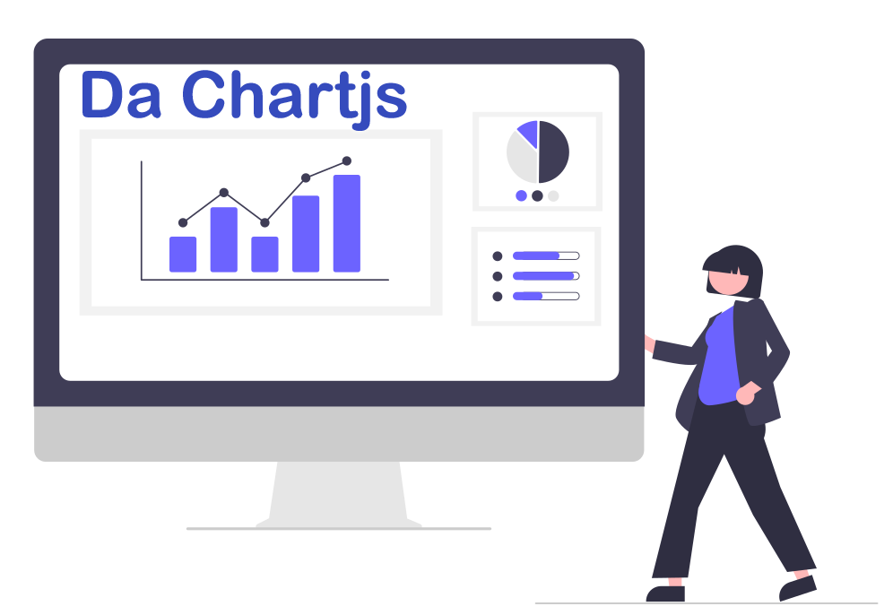
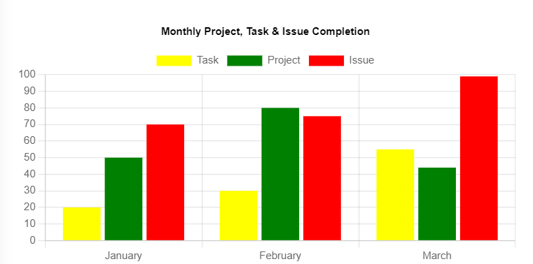
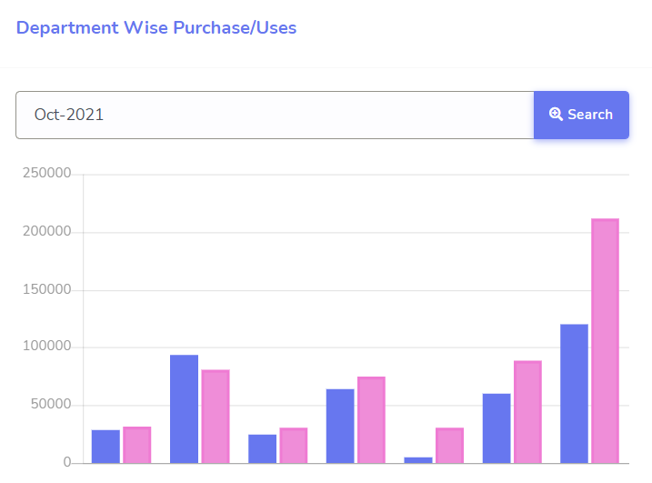

# Da Chart


This package used to generate server-side chart of [chart js](https://www.chartjs.org) and doesn't need to configure javascript in the front-side.
It will dynamically render HTML & JS configuration to view the chart.

## Examples
### Example 1: Monthly Project, Task and Issue Completion Chart

**Configuration:**
```php
use RadiateCode\DaChart\Chart;
use RadiateCode\DaChart\Facades\Dataset;
use RadiateCode\DaChart\Types\Bar\VerticalBarChart;

class ReportController extends Controller 
{
    .........................
        
    public function monthlyChart(){
        $datasets = [
            Dataset::label('Task')->data([20, 30,55])->backgroundColor('yellow')
                ->borderColor('black')->make(),
            Dataset::label('Project')->data([50, 80,44])->backgroundColor('green')
                ->borderColor('white')->make(),
            Dataset::label('Issue')->data([70, 75,99])->backgroundColor('red')
                ->borderColor('white')->make(),
        ];
    
        $monthlyChart = (new Chart('Monthly Chart', VerticalBarChart::class))
                ->labels(['January', 'February','March'])
                ->datasets($datasets)
                ->template();
        
        return view('dashboard')->with('monthlyChart',$monthlyChart);
    }
}
```
**In view (blade) file:**
```html
<div class="chart">
    <!-- generate chart canvas html -->
    {!! $chart->chartHtml() !!}
</div>

......
<!-- generate chart scripts -->
{!! $chart->chartLibrary() !!}
{!! $chart->chartScript() !!}
```
### Example 2: API or AJAX Chart

The chart shows purchases and uses product amount according to the month selection.

**Code:**

**Configuration in controller:**
```php
use RadiateCode\DaChart\Chart;
use RadiateCode\DaChart\Facades\Dataset;
use RadiateCode\DaChart\Types\Bar\VerticalBarChart;
class ReportController extends Controller 
{
    .........................
        
    public function monthlyChart(){
        $datasets = [
            
            Dataset::label('Purchase Products')
                ->data([]) // pass empty array to data() when load data via ajax
                ->backgroundColor('green')
                ->borderColor('black')->make(),
            Dataset::label('Uses Products')
                ->data([]) // pass empty array to data() when load data via ajax
                ->backgroundColor('red')
                ->borderColor('white')->make()
        ];
    
        $monthlyChart = (new Chart('Monthly Chart', VerticalBarChart::class))
                ->labels(['January', 'February','March'])
                ->datasets($datasets)
                ->template();
        
        return view('dashboard')->with('monthlyChart',$monthlyChart);
    }
}
```
**In blade file:**
```html
<div class="chart">
    <input type="text" id="month_elm_id" class="form-control month" placeholder="" aria-label="">
    <button class="btn btn-primary" id="search-btn" type="button">
        <i class="fa fa-search-plus"></i> Search
    </button>
    <!-- generate chart canvas html -->
    {!! $chart->chartHtml() !!}
</div>

......
<!-- generate chart scripts -->
{!! $chart->chartLibrary() !!}
{!! $chart->apiChartScript(url('fetch/monthly/chart'), 'search-btn', "month_elm_id")) !!}
```
> Depend on user's month selection chart will be refreshed or update.
> When "search-btn" is triggered it will get value from input element of month, attach the value with the given url as query string and send request to server to fetch data.

**Api Route & Response:**

```php
Route::get('fetch/monthly/chart','DashboardController@fetchData');

............

class DashboardController extends Controller {
    public function fetchData(Request $request){
        // place db query to fetch data form db
        // query can be filter by url params or query string
        
        // url params or query string can be access through $request->get('key')
        // [ex: $request->get('month_elm_id');]
        
        return response()->json([
            // sample data 
            'data' => [
                [150, 300, 350], // purchase product amount for jan, feb, mar months
                [150, 287, 330] // uses product amount for jan, feb, mar months
            ]
        ],200);
    }
}
```
# Installation
You can install the package via composer:

    composer require radiatecode/dachart

# Usages
In two ways you can generate chart by creating [new Chart()](#generate-chart-by-object) object or [creating dedicated class](#generate-chart-by-dedicated-class).

## Generate chart by object

```php
$barChart = new Chart('Monthly Chart', HorizontalBarChart::class);
```
> 
> ***Note: 2nd arg is [type of chart](#chart-types)***. 

### Available Methods of Chart:
#### labels()
labeling the data index of the chart. it could be x-axis or y-axis
```php
$barChart->labels(['January', 'February','March'])
```
#### datasets()

```php
$barChart->datasets([])
```
> Datasets can be build by **Dataset Facades**

Example:
```php
 $datasets = [
    Dataset::label('Task')->data([20, 30,55])->backgroundColor('yellow')
        ->borderColor('black')->make(),
    Dataset::label('Project')->data([50, 80,44])->backgroundColor('green')
        ->borderColor('white')->make(),
    Dataset::label('Issue')->data([70, 75,99])->backgroundColor('red')
        ->borderColor('white')->make(),
];
        
$barChart->datasets($datasets);
```
> Or datasets can be configured as manual

Example:
```php
 $datasets = [
    [
        "label"           => "Task",
        "backgroundColor" => "yellow",
        "data"            => [20, 30,55],
        "borderColor"     => "yellow",
    ],
    [
        "label"           => "Project",
        "backgroundColor" => "green",
        "data"            => [50, 80,44],
        "borderColor"     => "green",
    ],
    [
        "label"           => "Issue",
        "backgroundColor" => "red",
        "data"            => [70, 75,99],
        "borderColor"     => "red",
    ],
];
        
$barChart->datasets($datasets);
```
#### changeDefaultOption() [Optional]
Every type of chart has a dedicated class, and each type of chart class comes with predefined options. For example see the **defaultOptions()** methods of **[HorizontalBarChart](src/Types/Bar/HorizontalBarChart.php)** , **[MultiAxisLineChart](src/Types/Line/MultiAxisLineChart.php)**

So, in some scenario you may need to update the values of default options. In that case you can use **changeDefaultOption('optionKey','value')**

```php
$barChart->changeDefaultOption('plugins.title.text','Monthly Project, Task And Issue Chart')
```
> Note: dot used in key arg to indicate the nested level of the options

For multiple modification you can chain the method as we needs
```php
$barChart->changeDefaultOption('plugins.title.text','Monthly Project, Task And Issue Chart')
        ->changeDefaultOption('plugins.title.color','blue')
```
#### options() [Optional]
If you don't want to use default options then use your custom options
```php
$barChart->options([
        'responsive' => false,
        'plugins'    => [
            'legend' => [
                'display'  => true,
                'position' => 'top',
            ],
            'title'  => [
                'text'     => 'Custom Title',
                'position' => 'top',
                'display'  => true,
                'color'    => 'black',
            ],
        ],
    ])
```
#### render()
Render method will return array of chart configurations. The configuration later can be manually used in javascript
```php
$barChart->render();
```
#### Check the sample code [here](examples/RENDER-EXAMPLE.md)

#### template()
If you don't want to setup javascript manually in view file then use **template()** instead of **render()**
```php
$barChart->template();
```
> Template method return a html builder instance.
#### Methods of html builder
 - **chartHtml()** : generate html canvas tag
 - **chartLibrary()** : generate the chart.js CDN
 - **chartScript()** : generate back-end configured chart scripts
   > Check the sample code [here](examples/TEMPLATE-EXAMPLE-1.md)
 - **apiChartScript($url, $fireEventElementId = null, ...$filterElementIds)** : generate back-end configured chart and ajax scripts. It loads chart data & labels via ajax. 
    It also allows update or refresh the chart via firing js click event.
    > For api chart response you have to use [ChartResponse class](src/Response/ChartResponse.php)
   
    >  If you just want to load chart data by ajax then only pass value to 1st arg. 
    >> **Check the sample Code [here](examples/TEMPLATE-EXAMPLE-2.md)**

    > If you want to update the chart based on some input values then you have to pass a html button ID in the 2nd arg and input IDs 
    In the 3rd arg. 
    >> **Check the sample Code [here](examples/TEMPLATE-EXAMPLE-3.md)**
   
## Generate chart by dedicated class
Run the command to create a chart class

    php artisan make:dachart MonthlyCompletionChart

### Sample Code:
```php
<?php


namespace App\Charts;


use RadiateCode\DaChart\Abstracts\AbstractChart;
use RadiateCode\DaChart\Facades\Dataset;
use RadiateCode\DaChart\Types\Bar\HorizontalBarChart;

class MonthlyCompletionChart extends AbstractChart
{
	/**
     * Chart title
     *
     * ---------------------------------------------------------------------
     * Note: it can be use as chart id or chart name in js & html
     * ---------------------------------------------------------------------
     *
     * @return string
     */
    protected function chartTitle(): string
    {
        return 'Month Chart';
    }

	/**
     * Chart type
     *
     * ---------------------------------------------------------------------
     * Note: Chart type must be path of a concrete class of TypeInterface
     * [ex: HorizontalBarChart::class]
     * ---------------------------------------------------------------------
     *
     * @return string
     */
    protected function chartType(): string
    {
        return HorizontalBarChart::class;
    }

	/**
     * Chart labels
     *
     * ---------------------------------------------------------------------------------
     * Note: This labels are used to label the data index (default x axis) in the chart view
     * ---------------------------------------------------------------------------------
     *
     * @return array
     */
    protected function labels(): array
    {
        return [
            'January',
            'February',
            'March'
        ];
    }

	/**
     * Dataset
     *
     * -------------------------------------------------------------------------------------------------
     * Note: datasets can be generate by Dataset Facade Or we can pass custom array with dataset properties,
     * -------------------------------------------------------------------------------------------------
     *
     * @return array
     */
    protected function datasets(): array
    {
        return [
            Dataset::general('Project',[20, 30,55])->make(),
            Dataset::general('Task',[50, 80,44])->make(),
            Dataset::general('Task',[70, 75,99])->make()
        ];
    }
    
    /**
     * Change default options when necessary
     *
     * @return array
     */
    protected function changeDefaultOptions(): array
    {
        return [];
    }
    
    /**
     * Use custom options when we don't want to use the default. 
     * 
     * @return array
     */
    protected function options(): array
    {
        return [];
    }
}
```
We can change chart default options when necessary by the **changeDefaultOptions()**
```php
class MonthlyCompletionChart extends AbstractChart
{
    ................................
    
    protected function changeDefaultOptions(): array
    {
        return [
             // dot used in key is to indicate nested level of option properties
            'plugins.title.text' => 'Monthly Completion Chart',
            'plugins.title.color' => 'red',
        ];
    }

    .................................
}
```
Or we can provide custom options by the **options()**  if we don't want to use default.
```php
class MonthlyCompletionChart extends AbstractChart
{
    ................................
    
    protected function options(): array
    {
         return [
                'responsive' => true,
                'scales' => [
                    'xAxes' => [[
                        'ticks' => [
                            'beginAtZero' => true,
                            'maxRotation' => 90,
                            'minRotation' => 90
                        ]
                    ]]
                ],
                'tooltips' => [
                    'mode' => 'index',
                    'intersect' => false
                ],
                'plugins'    => [
                    'legend' => [
                        'display'  => true,
                        'position' => 'right',
                    ],
                    'title'  => [
                        'text'     => 'My Chart Title',
                        'position' => 'top',
                        'display'  => true,
                        'color'    => 'yellow',
                    ],
                ]
            ];
    }

    .................................
}
```
> To know more about the **options** properties see chart js official [documentation](https://www.chartjs.org/docs/latest).

**In controller:**

Now we will use that dedicated class in the controller
```php
use App\Charts\MonthlyCompletionChart;

class ReportController extends Controller
{
    .........................

    public function monthlyChart(){
        $monthlyChart =  new MonthlyCompletionChart();
        
        //return view('dashboard')->with('monthlyChart',$monthlyChart->render());
        return view('dashboard')->with('monthlyChart',$monthlyChart->template());
    }
}
```
## Chart Types
There are various predefined types of chart (configured) available such as
#### Bar chart
- **[Horizontal Bar Chart](src/Types/Bar/HorizontalBarChart.php)**
- **[Stacked Bar Chart](src/Types/Bar/StackedBarChart.php)**
- **[Vertical Bar Chart](src/Types/Bar/VerticalBarChart.php)**
#### Line chart
- **[Interpolation Line Chart](src/Types/Line/InterpolationLineChart.php)**
- **[Line Chart](src/Types/Line/LineChart.php)**
- **[Multi Axis Line Chart](src/Types/Line/MultiAxisLineChart.php)**
- **[Stepped Line Chart](src/Types/Line/SteppedLineChart.php)**
#### [Bubble chart](src/Types/Bubble/BubbleChart.php)
#### [Pie chart](src/Types/Pie/PieChart.php)
#### [Doughnut chart](src/Types/Doughnut/DoughnutChart.php)
#### [Polar Area Chart](src/Types/PolarArea/PolarAreaChart.php)
#### [Radar Chart](src/Types/Radar/RadarChart.php)
#### [Scatter Chart](src/Types/Scatter/ScatterChart.php)

> You can create your own custom type by extending **[BaseChartType](src/Abstracts/AbstractChart.php)**. Namespace could be **App\Charts\Types** (create Charts\Types folder inside the app folder)
## Dataset Facade
Dataset Facade can be helpful to generate dataset for chart configuration, each dataset has various properties such as label, background color, border color, data, fill, boarder width etc. A single dataset is made by setting up these properties. Above examples or sample code shows that
how to generate datasets by using **Dataset Facade**
### Methods
See the available [methods](src/Contracts/DatasetInterface.php) of Dataset Facade

## Dedicated Dataset Class (Suggestion)
If you create a chart with multiple datasets which depends on multiple db query then it would be nicer to create a separate dataset class, so that it increase the readability, maintainability of the code

> Namespace could be **App\Charts\Datasets** (create Charts\Datasets folder inside the app folder)

**Check the sample code [here](examples/DATASET-EXAMPLE.md)**

## Contributing
Please see [CONTRIBUTING](CONTRIBUTING.md) for details.

## Security
If you discover any security related issues, please email [radiate126@gmail.com](mailto:radiate126@gmail.com) instead of using the issue tracker.

## Credits separated
- [Noor Alam](https://github.com/radiatecode)
- [All Contributors](https://github.com/radiatecode/dachart/contributors)


## License

The MIT License (MIT). Please see [License File](LICENSE.md) for more information.

