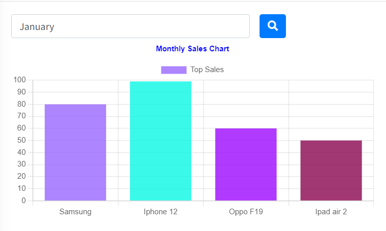

# Da Chart


This package used to generate server-side chart of [chart js](https://www.chartjs.org) and doesn't need to configure javascript in the front-side.
It will dynamically render HTML & JS configuration to view the chart.

## Examples
### Example 1: Monthly Project, Task and Issue Completion Chart

**In controller:**
```php
use RadiateCode\DaChart\Chart;
use RadiateCode\DaChart\Facades\Dataset;
use RadiateCode\DaChart\Types\Bar\HorizontalBarChart;

class ReportController extends Controller 
{
    .........................
        
    public function monthlyChart(){
        $datasets = [
            Dataset::label('Task')->data([20, 30,55])->backgroundColor('yellow')
                ->borderColor('black')->make(),
            Dataset::label('Project')->data([50, 80,44])->backgroundColor('green')
                ->borderColor('white')->make(),
            Dataset::label('Issue')->data([70, 75,99])->backgroundColor('red')
                ->borderColor('white')->make(),
        ];
    
        $monthlyChart = (new Chart('Monthly Chart', HorizontalBarChart::class))
                ->labels(['January', 'February','March'])
                ->datasets($datasets)
                ->template();
        
        return view('dashboard')->with('monthlyChart',$monthlyChart);
    }
}
```
**In blade file:**
```html
<div class="chart">
    <!-- generate chart canvas html -->
    {!! $chart->chartHtml() !!}
</div>

......
<!-- generate chart scripts -->
{!! $chart->chartLibrary() !!}
{!! $chart->chartScript() !!}
```
***Output:***


### Example 2: API or Remote Datasource based chart

The chart shows purchases and uses product amount according to the month selection.

**Code:**

**In controller:**
```php
use RadiateCode\DaChart\Chart;
use RadiateCode\DaChart\Facades\Dataset;
use RadiateCode\DaChart\Types\Bar\HorizontalBarChart;
class ReportController extends Controller 
{
    .........................
        
    public function monthlyChart(){
        $datasets = [
            Dataset::label('Purchase Products')->data([])->backgroundColor('green')
                ->borderColor('black')->make(),
            Dataset::label('Uses Products')->data([])->backgroundColor('red')
                ->borderColor('white')->make()
        ];
    
        $monthlyChart = (new Chart('Monthly Chart', HorizontalBarChart::class))
                ->labels(['January', 'February','March'])
                ->datasets($datasets)
                ->template();
        
        return view('dashboard')->with('monthlyChart',$monthlyChart);
    }
}
```
**In blade file:**
```html
<div class="chart">
    <input type="text" id="month_elm_id" class="form-control month" placeholder="" aria-label="">
    <button class="btn btn-primary" id="search-btn" type="button">
        <i class="fa fa-search-plus"></i> Search
    </button>
    <!-- generate chart canvas html -->
    {!! $chart->chartHtml() !!}
</div>

......
<!-- generate chart scripts -->
{!! $chart->chartLibrary() !!}
{!! $chart->apiChartScript(url('fetch/monthly/chart'), 'search-btn', "month_elm_id")) !!}
```
> Depend on user's month selection chart will be refreshed or update.
> When "search-btn" is triggered it will get value from month element, then attach it with the given url as query string and send request to server to fetch data.

**Api Route:**

```php
Route::get('fetch/monthly/chart','DashboardController@fetchData');

............

class DashboardController extends Controller {
    public function fetchData(Request $request){
        // place db query to fetch data form db
        // query can be filter by url params or query string
        // url params or query string can be access through $request->get('key')
        // [ex: $request->get('month_elm_id');]
        
        // sample data 
        $data = [
            [150, 300, 350], // purchase product amount for jan, feb, mar months
            [150, 287, 330] // uses product amount for jan, feb, mar months
        ];
        
        return response()->json($data,200);
    }
}
```
# Installation
You can install the package via composer:

    composer require radiatecode/dachart

# Usages
In two ways you can generate chart either creating new Chart() object nor creating dedicated class.

## Option 1: create chart by `new Chart()`

### Chart Object:
```php
$barChart = new Chart('Monthly Chart', HorizontalBarChart::class);
```
> Chart constructor have 2 args, 1st arg is chart title [ex: **Monthly Chart**], 2nd arg is type of chart [ex: **HorizontalBarChart::class**] is type of chart 
> [2nd arg must be a class path of TypeInterface]. 

### Methods of Chart Object:

#### Modification of chart options:
Each type of chart class comes with predefined options. For example see the **defaultOptions()** methods of **[HorizontalBarChart::class](src/Types/Bar/HorizontalBarChart.php)** , **[MultiAxisLineChart::class](src/Types/Line/MultiAxisLineChart.php)**

So, in some scenario we may need to update the values of predefined options. In that case we can use **changeDefaultOption('optionKey','value')**

```php
// NT: dot used in key arg to indicate the nexted level of the options
$barChart->changeDefaultOption('plugins.title.text','Monthly Project, Task And Issue Chart')
```
For multiple modification we can chain the method as we needs
```php
$barChart->changeDefaultOption('plugins.title.text','Monthly Project, Task And Issue Chart')
        ->changeDefaultOption('plugins.title.color','blue')
```
#### Custom Chart Options:
If you don't want to use predefined options then use your custom options
```php
$barChart->options(function () {
    return [
        'responsive' => false,
        'plugins'    => [
            'legend' => [
                'display'  => true,
                'position' => 'top',
            ],
            'title'  => [
                'text'     => 'Custom Title',
                'position' => 'top',
                'display'  => true,
                'color'    => 'black',
            ],
        ],
    ];
})
```
#### Chart labels:
```php
// labeling the data of the chart. it could be x-axis or y-axis
$barChart->labels(['January', 'February','March'])
```
#### Chart datasets:

```php
$barChart->datasets([])
```
> Datasets can be build by **Dataset Facades**

```php
 $datasets = [
    Dataset::label('Task')->data([20, 30,55])->backgroundColor('yellow')
        ->borderColor('black')->make(),
    Dataset::label('Project')->data([50, 80,44])->backgroundColor('green')
        ->borderColor('white')->make(),
    Dataset::label('Issue')->data([70, 75,99])->backgroundColor('red')
        ->borderColor('white')->make(),
];
        
$barChart->datasets($datasets);
```
> Or datasets can be configured as manual

```php
 $datasets = [
    [
        "label"           => "Task",
        "backgroundColor" => "yellow",
        "data"            => [20, 30,55],
        "borderColor"     => "yellow",
    ],
    [
        "label"           => "Project",
        "backgroundColor" => "green",
        "data"            => [50, 80,44],
        "borderColor"     => "green",
    ],
    [
        "label"           => "Issue",
        "backgroundColor" => "red",
        "data"            => [70, 75,99],
        "borderColor"     => "red",
    ],
];
        
$barChart->datasets($datasets);
```
#### Render the chart:
```php
$barChart->render();
```
> Render method will return array of chart configurations. the configuration later can be manually used in javascript

#### Sample Code: 
```php
class WelcomeController extends Controller {
    public function index(){
            
            /**
            * --------------------------------------
            * 1. Dataset configure with Dataset Facades
            * --------------------------------------
            */
            $datasets = [
                Dataset::label('Task')->data([20, 30,55])->backgroundColor('yellow')
                    ->borderColor('black')->make(),
                Dataset::label('Project')->data([50, 80,44])->backgroundColor('green')
                    ->borderColor('white')->make(),
                Dataset::label('Issue')->data([70, 75,99])->backgroundColor('red')
                    ->borderColor('white')->make(),
            ];
            
            /**
            * --------------------------------------
            * 2. Dataset configure manually
            * --------------------------------------
            */
//            $datasets = [
//                [
//                    "label"           => "Task",
//                    "backgroundColor" => "yellow",
//                    "data"            => [20, 30,55],
//                    "borderColor"     => "yellow",
//                ],
//                [
//                    "label"           => "Project",
//                    "backgroundColor" => "green",
//                    "data"            => [50, 80,44],
//                    "borderColor"     => "green",
//                ],
//                [
//                    "label"           => "Issue",
//                    "backgroundColor" => "red",
//                    "data"            => [70, 75,99],
//                    "borderColor"     => "red",
//                ],
//            ];
            
         
            /**
            * -------------------------------------- 
            * 1. create chart with default options
            * --------------------------------------
            */
            $barChart = (new Chart('Monthly Chart', HorizontalBarChart::class))
                ->labels(['January', 'February','March'])
                ->datasets($datasets)
                ->render();
                 
            /**
            * --------------------------------------
            * 2. create chart with modification of default options 
            * --------------------------------------
            */
//            $barChart = (new Chart('Monthly Chart', HorizontalBarChart::class))
//                ->changeDefaultOption('plugins.title.text','Monthly Project, Task And Issue Chart')
//                ->changeDefaultOption('plugins.title.color','blue')
//                ->labels(['January', 'February','March'])
//                ->datasets($datasets)
//                ->render();    
                
            /**
            * --------------------------------------
            * 3. create chart with custom options 
            * --------------------------------------
            */
//            $barChart = (new Chart('Monthly Chart', HorizontalBarChart::class))
//                ->options(function(){
//                    return [
//                        'responsive' => false,
//                        'plugins'    => [
//                            'legend' => [
//                                'display'  => true,
//                                'position' => 'top',
//                            ],
//                            'title'  => [
//                                'text'     => 'Custom Title',
//                                'position' => 'top',
//                                'display'  => true,
//                                'color'    => 'black',
//                            ],
//                        ],
//                    ];              
//                })
//                ->labels(['January', 'February','March'])
//                ->datasets($datasets)
//                ->render();     
            
            // dd($barChart);   
               
            return view('dashboard')->with('barChart',$barChart);       
    }
}
```

**In view (dashboard.blade.php) file:**

```javascript
<script>
var serversideRenderedChartConfig = @json($barChart)

var chartCtx = document.getElementById("monthly_chart_canvas").getContext('2d');

var monthlyChart = new Chart(chartCtx,serversideRenderedChartConfig);
</script>
```

#### Chart Template:
If you don't want to setup javascript manually in view file then use **template()** instead of **render()**
```php
$barChart->template();
```
> Template method return a builder instance where it provides  
> - **chartHtml()** : generate html canvas tag
> - **chartScript()** : generate chart scripts
> - **apiChartScript($url, $loadTriggerId = null, ...$filterElementIds)** : it will help to load chart data (not the whole chart config, only data of datasets) via ajax. It also allows updating or refresh the chart based on filter options.
> [***NT: 2nd and 3rd args use when you need to apply filters on chart***]
> - **chartLibrary()** : generate the chart.js CDN
#### Sample Code:
```php
class WelcomeController extends Controller {
    public function index(){
            /**
            * --------------------------------------
            * Dataset configure manually
            * --------------------------------------
            */
            $datasets = [
                [
                    "label"           => "Task",
                    "backgroundColor" => "yellow",
                    "data"            => [],
                    "borderColor"     => "yellow",
                ],
                [
                    "label"           => "Project",
                    "backgroundColor" => "green",
                    "data"            => [],
                    "borderColor"     => "green",
                ],
                [
                    "label"           => "Issue",
                    "backgroundColor" => "red",
                    "data"            => [],
                    "borderColor"     => "red",
                ],
            ];
            
            /**
            * --------------------------------------
            * create chart with modification of default options 
            * --------------------------------------
            */
            $barChart = (new Chart('Monthly Chart', HorizontalBarChart::class))
                ->changeDefaultOption('plugins.title.text','Monthly Project, Task And Issue Chart')
                ->changeDefaultOption('plugins.title.color','blue')
                ->labels(['January', 'February','March'])
                ->datasets($datasets)
                ->template();    
                  
            return view('dashboard')->with('chart',$barChart);       
    }
}
```
**In view (blade) file:**

Ex 1: Load chart data by ajax

```html
<div class="chart">
    <div class="chart">
        <!-- generate chart canvas html -->
        {!! $chart->chartHtml() !!}
    </div>
</div>

......

<!-- generate chart.js CDN -->
{!! $chart->chartLibrary() !!}

<!-- use it when you need to load chart data by ajax -->
{!! $chart->apiChartScript(url('fetch/monthly/completion/chart'))) !!}
```
Ex 2: Load chart data by ajax and update or refresh chart by applying filters
```html
<div class="chart">
    <input type="text" id="start_date" class="form-control datepicker" placeholder="" aria-label="">
    <input type="text" id="end_date" class="form-control datepicker" placeholder="" aria-label="">
    <button class="btn btn-primary" id="search-btn" type="button">
        <i class="fa fa-search-plus"></i> Search
    </button>
    <div class="chart">
        <!-- generate chart canvas html -->
        {!! $chart->chartHtml() !!}
    </div>
</div>

......

<!-- generate chart.js CDN -->
{!! $chart->chartLibrary() !!}

<!-- use it when you need to load chart data by ajax and also update or refresh chart based on filters -->
{!! $chart->apiChartScript(url('fetch/monthly/completion/chart'), 'search-btn', "start_date","end_date")) !!}
```

**Api Route:**

```php
Route::get('fetch/monthly/completion/chart','ChartController@completionData');

............

class ChartController {
    public function completionData(Request $request){
        // place db query to fetch data form db
        // query can be filter by url params or query string
        // url params can be access through $request->get('key')
        // [ex: $request->get('start_date'), $request->get('end_date')]
        
        // sample data 
        $data = [
            [150, 300, 350], // Task data
            [150, 287, 330], // Project Data
            [150, 287, 330] // Issue Data
        ];
        
        return response()->json($data,200);
    }
}
```

## Option 2: create chart by dedicated class
Create a new chart class
    
    php artisan make:dachart MonthlyCompletionChart

#### Sample Code:
```php
<?php


namespace App\Charts;


use RadiateCode\DaChart\Abstracts\AbstractChart;
use RadiateCode\DaChart\Facades\Dataset;
use RadiateCode\DaChart\Types\Bar\HorizontalBarChart;

class MonthlyCompletionChart extends AbstractChart
{
	/**
     * Chart title
     *
     * ---------------------------------------------------------------------
     * Note: it can be use as chart id or chart name in js & html
     * ---------------------------------------------------------------------
     *
     * @return string
     */
    protected function chartTitle(): string
    {
        return 'Month Chart';
    }

	/**
     * Chart type
     *
     * ---------------------------------------------------------------------
     * Note: Chart type must be path of a concrete class of TypeInterface
     * [ex: HorizontalBarChart::class]
     * ---------------------------------------------------------------------
     *
     * @return string
     */
    protected function chartType(): string
    {
        return HorizontalBarChart::class;
    }

	/**
     * Chart labels
     *
     * ---------------------------------------------------------------------------------
     * Note: This labels are used to label the data index (default x axis) in the chart view
     * ---------------------------------------------------------------------------------
     *
     * @return array
     */
    protected function labels(): array
    {
        return [
            'January',
            'February',
            'March'
        ];
    }

	/**
     * Dataset
     *
     * -------------------------------------------------------------------------------------------------
     * Note: datasets can be generate by Dataset Facade Or we can pass custom array with dataset properties,
     * -------------------------------------------------------------------------------------------------
     *
     * @return array
     */
    protected function datasets(): array
    {
        return [
            Dataset::dataset('Project',[20, 30,55])->make(),
            Dataset::dataset('Task',[50, 80,44])->make(),
            Dataset::dataset('Task',[70, 75,99])->make()
        ];
    }
}
```
### Extra Methods of Chart Class (optional):

We can change chart default options when necessary by simply override the base **changeDefaultOptions()** in the chart class
```php
class MonthlyCompletionChart extends AbstractChart
{
    ................................
    
    /**
     * -----------------
     * Override
     * -----------------
     * 
     * @return array
     */
    protected function changeDefaultOptions(): array
    {
        return [
             // dot used in key is to indicate nested level of option properties
            'plugins.title.text' => 'Monthly Completion Chart',
            'plugins.title.color' => 'red',
        ];
    }

    .................................
}
```
Or we can set whole custom options by simply override the base **options()** method in the chart class.
```php
class MonthlyCompletionChart extends AbstractChart
{
    ................................
    
    /**
     * -----------------
     * Override
     * -----------------
     * 
     * @return array
     */
    protected function options(): array
    {
         return [
                'responsive' => true,
                'plugins'    => [
                    'legend' => [
                        'display'  => true,
                        'position' => 'right',
                    ],
                    'title'  => [
                        'text'     => 'My Chart Title',
                        'position' => 'top',
                        'display'  => true,
                        'color'    => 'yellow',
                    ],
                ]
            ];
    }

    .................................
}
```
> To know more about the **options** properties see chart js official [documentation](https://www.chartjs.org/docs/latest).

**In controller:**

```php
use App\Charts\MonthlyCompletionChart;

class ReportController extends Controller
{
    .........................

    public function monthlyChart(){
        $monthlyChart =  new MonthlyCompletionChart();
        
        return view('dashboard')->with('monthlyChart',$monthlyChart->template());
    }
}
```